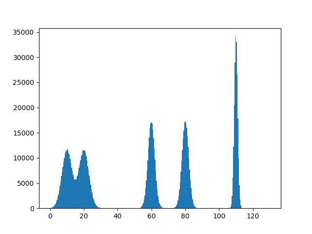
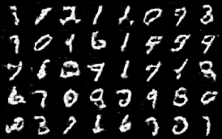
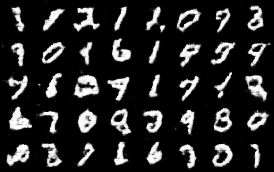
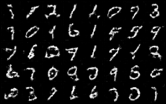
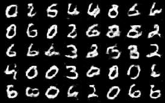
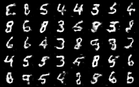

# MADGAN and DEGAN
We ran the experiments for MADGAN and our proposed modified network DEGAN on three datasets i.e MMG Synthetic 1D Dataset, MNIST and the CELEBA dataset. The code is written in PyTorch and the implementation is as close as possible to the one given in the MADGAN paper with some necessary changes made due to lack of clarity in the original paper or poor results obtained after using the original architecture.

#### Theory

#### How to Run the Experiments
The following were the main parameters (passed as command line arguments) that can be tweaked while running the experiments -
* epochs (number of epochs)
* gpu (run on GPU)
* gpu_add (address of GPU)
* noise (add instance noise)
* num_generators (number of generators)
* degan (use degan loss function of standard madgan loss function)
* sharing (use shared generator or not)
* lrg (learning rate of generator)
* lrd (learning rate of discriminator)
* seed (seed for the random generator)

Apart from these there were some other minor paramters which can be tweaked. The details of all the parameters can be obtained by running-

`python3 gmm-madgan.py -h`

A sample command for running the experiment on the MMG dataset with the degan loss function, instance noise added, sharing generator layers on gpu number 2 with generator learning rate and the discriminator learning rates as 1e-04 and seed set as 99 would be -

`python3 gmm-madgan.py --degan=1 --noise=1 --sharing=1 --lrg=1e-05 --lrd=1e-05 --seed=99`

`python3 gmm-madgan.py --degan=1 --noise=1 --sharing=1 --lrg=1e-05 --lrd=1e-05 --seed=99`

#### Log and Saving of Results
The output of the model is stored as images at various iterations of the training process. The output of each experiment is stored in a folder in the same directory as the main .py (gmm-madgan.py in case of MMG) file. The name of the directory contains the paramters with which the experiment was run.

The folder contains the log in log.txt and the results (images) produced by the generators at iterations of *chk_interval* parameter. The final model and its parameters are saved in the **.pth file**.

#### Results and Observations
See the results directory for details of the some of the experiments that we ran. The following three subsections give an overview of the results for the three individual datasets -
##### MMG (Mutli Modal Gaussian)
The dataset was synthetically prepared and the details are given in the [report](https://iitrpr.ac.in). Here's a graph of the data -

Here's an animation of the generations of the MADGAN & DEGAN network (with seed=99 and triple sharing) at various
iterations -

For more results and outputs of individual generators, see the [Results](https://github.com/vinx-2105/MADGAN/tree/master/Results/) directory.

##### MNIST
The second dataset we experimented on was the standard MNIST dataset. The results obtained in this case were more remarkable compared to the ones obtained in the case of the MMG dataset.

On this dataset, we clearly observed that DEGAN is able to more explicitly enforce diversity.
  
Output of the three generators using the MADGAN approach and sharing the first three layers  

  
Output of the three generators using the DEGAN approach and sharing the first three layers  

#### Report
For the network  proposed by DEGAN, a summary of the results obtained and an overview of the training technique, please see this [report](https://github.com)

#### Acknowledgements
We would like to thank [Dr. Narayanan C Krishnan](http://cse.iitrpr.ac.in/ckn/teaching.html) for his constant guidance and the opportunity to work under his supervision. We would also like to thank our seniors [Shivam Mittal](https://github.com/shivam5/) and [Abhishek Chaudhary](https://www.linkedin.com/in/abhishek-chaudhary-556171108/) for conceptualizing the idea and developing the theory for DEGAN.

### **References**
* [MADGAN Paper](https://arxiv.org/pdf/1704.02906.pdf)
* [PyTorch DCGAN Tutorial](https://pytorch.org/tutorials/beginner/dcgan_faces_tutorial.html)